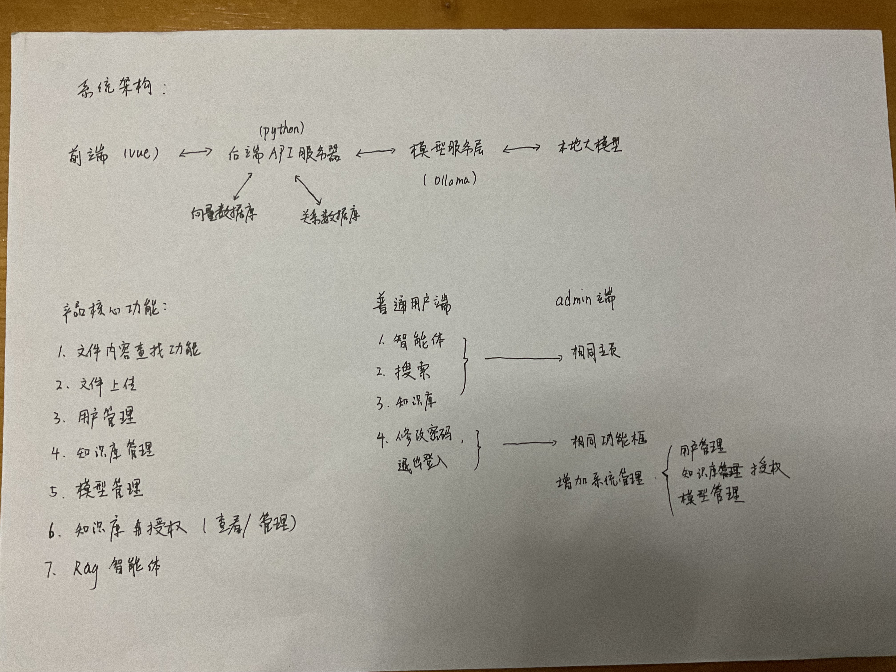

## RAG 知识问答系统 MVP 产品需求文档（PRD）

更新日期：2025-09-23  版本：v1.0-Rag-MVP  状态：已评审待实现

### 草图

### 1. 概述
- **产品定位**：公司内部面向员工的技术规范知识问答与智能检索平台，基于 RAG（Retrieval-Augmented Generation）方案，支持本地大模型推理，保障数据安全与可控性。
- **目标用户**：全体内部员工；管理员（含系统/知识库/模型管理职能）。
- **商业目标（内部效能）**：
  - 降低员工查阅规范文档时间成本 ≥ 50%
  - 提升技术规范答疑准确率与可追溯性（含引用与定位）
  - 建立合规可管的知识资产沉淀机制
- **不在范围（MVP 之外）**：移动端 App、外部第三方账号登录、复杂工作流审批、智能体多工具编排（除基础检索与问答外）。

### 2. 系统架构（高层）
- **前端**：Vue（PC Web）
- **后端**：Python API 服务层（Flask）
- **向量数据库**：Chroma 
- **关系数据库**：PostgreSQL 或 MySQL（MVP 推荐 PostgreSQL）
- **模型服务层**：
  - 本地大语言模型（LLM）：如 Qwen2/Llama3/ChatGLM，走本地推理或私有化推理服务
  - 向量/Embedding 模型：如 BGE/M3E（中文友好，维度常见 768/1024）
- **文件存储**：本地文件系统或对象存储（MVP 可用本地 NAS/磁盘）

数据流：
1) 上传 PDF → 解析/抽取 → 切片（Chunk）→ 生成向量 → 入库（RDB + 向量库）
2) 问答/搜索 → 检索（向量）→ 重排序（可选）→ 组装 Prompt → 本地 LLM 生成 → 返回答案 + 引用段落

### 3. 角色与权限
- **普通用户**：
  - 使用：智能体问答、搜索、查看被授权的知识库与文档
  - 账号操作：修改密码、退出登录
- **管理员（Admin）**：
  - 拥有普通用户全部功能
  - 系统管理：用户管理、知识库授权管理、模型管理

权限模型（MVP）：
- 角色：`user`、`admin`
- 知识库授权粒度：`查看`、`管理`（管理包含上传/删除文档、调整参数）

### 4. 关键功能模块与需求明细

#### 4.1 智能体知识问答（RAG 智能体）
- 功能点：
  - 会话式问答，支持选择知识库范围（单库）
  - 支持选择模型（若管理员开放多个模型）
  - 答案附带引用（文档名、页码/段落、点击可预览高亮）
  - 支持历史会话查看与重命名/删除
- 交互：
  - 输入问题 → 显示检索中 → 流式生成答案 → 展示引用列表
- RAG 设定（MVP）：
  - 检索：向量检索为主
  - Prompt：采用中文模板，包含指令、上下文片段、回答要求（引用、多段落、避免编造）
  - 答案结构：自然语言段落 + 引用列表（源文档、位置、置信度）

#### 4.2 搜索（文件内容查找）
- 功能点：
  - 关键字搜索（标题/内容），分页返回
  - 支持按知识库过滤
  - 结果摘要/片段高亮，点击预览定位处
  - 支持导出搜索结果（CSV）
- 检索实现（MVP）：
  - 向量检索（query embedding）
  - 结果合并与去重，按相似度得分排序

#### 4.3 文件上传（运用在知识库管理中）
- 支持格式：PDF（MVP 必须）
- 上传方式：Web 端表单拖拽/选择，多文件批量
- 限制：单文件 ≤ 200MB；批量 ≤ 20 文件/次（可配置）
- 元数据：文件名、所属知识库
- 处理流程：文件入库 → 解析（文本抽取/OCR 可选）→ 切片 → 向量生成 → 提示完成

#### 4.4 用户管理（Admin）
- 功能点：
  - 用户列表、创建用户、禁用/启用、重置密码
  - 角色分配（user/admin）
  - 基本信息编辑（姓名、电话、邮箱）
- 普通用户侧：修改密码、退出登录

#### 4.5 知识库管理
- 功能点：
  - 创建/编辑/删除知识库（名称、描述、可见范围）
  - 文档列表展示
  - 切片策略与检索参数（chunk 大小/重叠、TopK）配置（MVP 可按库级统一）
  - 批量导入/删除文档
  - 导入任务重试与失败重跑

#### 4.6 知识库授权（查看/管理）
- 授权对象：普通用户
- 权限项：查看（read）、管理（manage）
- 行为：
  - 管理员在知识库下为普通用户授予/回收权限
  - 用户仅可见被授权知识库与其中文档

#### 4.7 模型管理（Admin）
- 功能点：
  - 模型列表：名称、类型（LLM/Embedding）、提供方（本地）、端点/路径、状态
  - 新增/编辑/删除模型；设为默认推理模型/默认向量模型
  - 参数：最大上下文、温度、TopP、频率惩罚等（按模型能力）
  - 健康检查：连通性/加载成功/延迟统计（MVP 可提供一次性自检）

### 5. 非功能性需求（NFR）
- **性能**：
  - 搜索请求 P50 ≤ 3s；RAG 答案首字节 ≤ 5s（本地模型，硬件适配）
  - 导入 1,000 页 PDF 的解析+嵌入：≤ 20 分钟（并发 4 任务）
- **可用性**：
  - 服务可用性 ≥ 99%；导入任务失败可重试
- **安全**：
  - 仅内部网络访问；登录鉴权（JWT/Session）；操作日志
  - 文件与向量数据与用户权限严格隔离；敏感信息脱敏展示
- **合规**：
  - 符合公司内部数据分级与最小权限原则
- **扩展性**：
  - 模型/向量库可插拔；多知识库

### 6. 验收标准
- 登录与权限：未登录访问受限路由被拦截；普通用户无法访问管理端
- 上传：10 份 PDF 成功导入；进度状态正确；失败文件可重跑成功
- 搜索：输入关键字返回相关片段并高亮；过滤生效；延迟 P50 ≤ 3s
- 问答：选择知识库提问，答案包含≥2条有效引用；首字节 ≤ 4s
- 授权：对未授权用户隐藏知识库与文档；回收权限后即时生效
- 模型：默认模型可切换并生效；健康检查通过

（本文档为 MVP 范围，后续增强如知识图谱、多模态、复杂工具调用等将另行规划）
