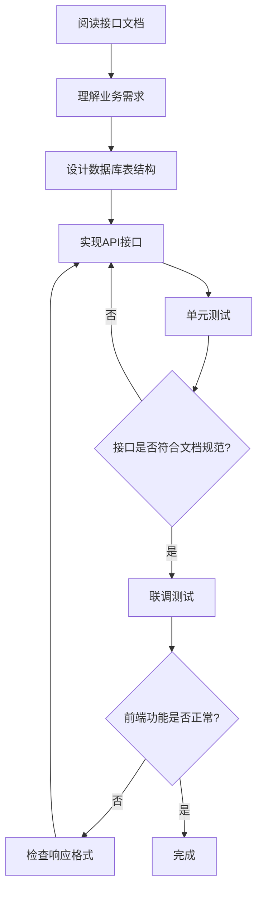

# 后端开发工作流程与接口开发指南

> **项目**: RAG知识问答系统  
> **协作模式**: 前后端分离开发 + 接口文档驱动  
> **更新日期**: 2025-10-04

---

## 📋 目录

1. [开发准备](#1-开发准备)
2. [快速启动](#2-快速启动)
3. [开发流程](#3-开发流程)
4. [接口开发规范](#4-接口开发规范)
5. [联调测试](#5-联调测试)
6. [生产部署](#6-生产部署)
7. [常见问题](#7-常见问题)

---

## 1. 开发准备

### 1.1 环境要求

**后端开发环境**：
- Python 3.8+ / Node.js 18+ / Java 11+ （根据实际技术栈）
- 数据库：MySQL/PostgreSQL/MongoDB
- 向量数据库：Milvus/Qdrant/Weaviate
- Redis（可选，用于缓存）

**前端开发环境**（用于联调）：
- Node.js >= 20.19.0 或 >= 22.12.0
- npm

### 1.2 项目结构

```
ZhongMeiRagProject/
├── frontEnd/              # 前端项目（已完成）
│   ├── src/               # 前端源码
│   ├── dist/              # 前端构建产物（npm run build生成）
│   └── package.json       # 前端依赖配置
├── backEnd/               # 后端项目（待开发）
│   ├── api/               # API接口
│   ├── services/          # 业务逻辑
│   ├── models/            # 数据模型
│   ├── utils/             # 工具函数
│   └── config/            # 配置文件
└── doc/
    ├── api/
    │   ├── api-front-back.md  # 前后端接口文档（核心）
    │   └── backEndDev.md      # 本文档
    ├── Rag-MVP.md            # 产品需求文档
    └── iconfont.md           # 图标需求文档
```

### 1.3 获取前端代码和文档

**必读文档**：
1. **`doc/api/api-front-back.md`** - 前后端接口规范（最重要）
2. **`doc/Rag-MVP.md`** - 产品需求和业务逻辑
3. **`frontEnd/README.md`** - 前端项目说明

**获取前端项目**：
```bash
# 如果使用Git
git clone <repository-url>
cd ZhongMeiRagProject

# 安装前端依赖（用于联调）
cd frontEnd
npm install
```

---

## 2. 快速启动

### 2.1 前端独立开发模式（Mock数据）

前端已经实现了完整的Mock数据系统，后端开发期间前端可以独立运行：

```bash
cd frontEnd
npm run dev
```

前端会自动启动在 `http://localhost:5173`，使用Mock数据，无需后端服务。

### 2.2 前后端联调模式

#### 步骤1：启动后端服务

```bash
cd backEnd

# Python Flask 示例
python app.py

# Python FastAPI 示例
uvicorn main:app --reload --host 0.0.0.0 --port 8000

# Node.js Express 示例
npm start

# 确保后端服务运行在 http://localhost:8000
```

#### 步骤2：修改前端配置连接后端

**方法一：修改 `frontEnd/src/utils/env.js`**（推荐）

```javascript
// 将 USE_MOCK 改为 false
export const USE_MOCK = false  // 改为 false 连接真实后端
```

**方法二：如果后端端口不是8000，修改 `frontEnd/vite.config.js`**

```javascript
server: {
  proxy: {
    '/api': {
      target: 'http://localhost:8000',  // 修改为实际后端端口
      changeOrigin: true,
    }
  }
}
```

#### 步骤3：启动前端开发服务器

```bash
cd frontEnd
npm run dev
```

前端会运行在 `http://localhost:5173`，所有 `/api/*` 请求会自动转发到后端 `http://localhost:8000`。

### 2.3 测试账号

开发和测试使用以下账号：

| 用户名 | 密码 | 角色 | 说明 |
|--------|------|------|------|
| admin | admin123 | 管理员 | 拥有所有权限 |
| user | user123 | 普通用户 | 普通用户权限 |

---

## 3. 开发流程

### 3.1 接口文档驱动开发（核心流程）



### 3.2 推荐开发顺序

按照模块优先级，建议按以下顺序开发：

#### 第一阶段：基础功能（优先级：⭐⭐⭐⭐⭐）

1. **用户认证模块** - `doc/api/api-front-back.md` 第1章
   - POST /api/auth/login - 用户登录
   - POST /api/auth/logout - 用户登出
   - POST /api/auth/change-password - 修改密码

2. **知识库查询模块** - `doc/api/api-front-back.md` 第2章
   - POST /api/knowledge-base/stats - 获取统计数据
   - POST /api/knowledge-base/list - 获取知识库列表

#### 第二阶段：核心功能（优先级：⭐⭐⭐⭐）

3. **智能问答模块** - `doc/api/api-front-back.md` 第3章
   - POST /api/chat/knowledge-bases - 获取知识库列表
   - POST /api/chat/models - 获取模型列表
   - POST /api/chat/session/create - 创建会话
   - POST /api/chat/message/send - 发送消息（核心）

4. **个人中心模块** - `doc/api/api-front-back.md` 第5章
   - POST /api/user/profile - 获取个人信息
   - POST /api/user/profile/update - 更新个人信息
   - POST /api/user/change-password - 修改密码

#### 第三阶段：管理功能（优先级：⭐⭐⭐）

5. **管理员仪表盘** - `doc/api/api-front-back.md` 第6章
   - POST /api/dashboard/stats - 获取统计数据
   - POST /api/dashboard/system-status - 获取系统状态

6. **知识库管理** - `doc/api/api-front-back.md` 第2章
   - POST /api/knowledge-base/documents - 获取文档列表
   - POST /api/knowledge-base/upload-document - 上传文档
   - POST /api/knowledge-base/delete-document - 删除文档

7. **用户管理** - `doc/api/api-front-back.md` 第7章
   - POST /api/admin/users/list - 获取用户列表
   - POST /api/admin/users/create - 创建用户
   - POST /api/admin/users/update - 更新用户

#### 第四阶段：扩展功能（优先级：⭐⭐）

8. **文档搜索模块** - `doc/api/api-front-back.md` 第4章
9. **模型管理模块** - `doc/api/api-front-back.md` 第8章

### 3.3 单个接口开发步骤

以 **用户登录** 接口为例：

#### 步骤1：查看接口文档

打开 `doc/api/api-front-back.md`，找到 **1.1 用户登录**：

```markdown
### 1.1 用户登录
- **接口**: POST /api/auth/login
- **权限**: 无需登录

**请求参数:**
{
  "username": "string, 用户名",
  "password": "string, 密码"
}

**响应格式:**
{
  "error": 0,
  "message": "登录成功",
  "body": {
    "token": "string",
    "user": {
      "id": "string",
      "username": "string",
      "name": "string",
      "role": "string",
      "email": "string",
      "phone": "string"
    }
  }
}
```

#### 步骤2：实现接口

**Python Flask 示例**：

```python
from flask import Flask, request, jsonify
import jwt
import datetime

app = Flask(__name__)
app.config['SECRET_KEY'] = 'your-secret-key'

@app.route('/api/auth/login', methods=['POST'])
def login():
    """用户登录接口"""
    try:
        # 1. 获取请求参数
        data = request.get_json()
        username = data.get('username')
        password = data.get('password')
        
        # 2. 参数验证
        if not username or not password:
            return jsonify({
                'error': 1001,
                'message': '用户名和密码不能为空',
                'body': {}
            }), 400
        
        # 3. 验证用户（查询数据库）
        user = db.query_user_by_username(username)
        if not user or not verify_password(password, user.password_hash):
            return jsonify({
                'error': 1002,
                'message': '用户名或密码错误',
                'body': {}
            }), 401
        
        # 4. 生成token
        token = jwt.encode({
            'user_id': user.id,
            'exp': datetime.datetime.utcnow() + datetime.timedelta(days=7)
        }, app.config['SECRET_KEY'], algorithm='HS256')
        
        # 5. 返回成功响应（必须符合文档格式）
        return jsonify({
            'error': 0,
            'message': '登录成功',
            'body': {
                'token': token,
                'user': {
                    'id': user.id,
                    'username': user.username,
                    'name': user.name,
                    'role': user.role,
                    'email': user.email,
                    'phone': user.phone
                }
            }
        }), 200
        
    except Exception as e:
        # 6. 异常处理
        return jsonify({
            'error': 500,
            'message': '系统异常，请稍后重试',
            'body': {}
        }), 500
```

#### 步骤3：使用Postman/curl测试

```bash
curl -X POST http://localhost:8000/api/auth/login \
  -H "Content-Type: application/json" \
  -d '{
    "username": "admin",
    "password": "admin123"
  }'
```

**期望响应**：
```json
{
  "error": 0,
  "message": "登录成功",
  "body": {
    "token": "eyJhbGciOiJIUzI1NiIsInR5cCI6IkpXVCJ9...",
    "user": {
      "id": "user_001",
      "username": "admin",
      "name": "张三",
      "role": "admin",
      "email": "admin@company.com",
      "phone": "13800138000"
    }
  }
}
```

---

## 4. 接口开发规范

### 4.1 统一响应格式（重要⭐⭐⭐⭐⭐）

**所有接口必须严格遵循以下响应格式**：

```json
{
  "error": 0,          // 错误码，0表示成功
  "message": "提示信息",
  "body": {}           // 业务数据
}
```

### 4.2 错误码规范

| 错误码 | 说明 | HTTP状态码 | 前端处理 |
|--------|------|-----------|---------|
| 0 | 成功 | 200 | 正常处理数据 |
| 401 | 未登录或登录过期 | 401 | 跳转到登录页 |
| 403 | 权限不足 | 403 | 显示无权限提示 |
| 500 | 系统异常 | 500 | 显示错误提示 |
| 1001-1999 | 用户认证相关错误 | 400 | 显示message |
| 2001-2999 | 知识库相关错误 | 400 | 显示message |
| 3001-3999 | 对话相关错误 | 400 | 显示message |
| 4001-4999 | 搜索相关错误 | 400 | 显示message |

### 4.3 认证中间件

需要登录的接口必须验证 `Authorization` 头：

**Python Flask 示例**：
```python
from functools import wraps
import jwt

def require_auth(f):
    @wraps(f)
    def decorated_function(*args, **kwargs):
        token = request.headers.get('Authorization')
        if not token:
            return jsonify({
                'error': 401,
                'message': '请先登录',
                'body': {}
            }), 401
        
        try:
            # 移除 "Bearer " 前缀
            token = token.replace('Bearer ', '')
            payload = jwt.decode(token, app.config['SECRET_KEY'], algorithms=['HS256'])
            request.user_id = payload['user_id']
        except jwt.ExpiredSignatureError:
            return jsonify({
                'error': 401,
                'message': '登录已过期，请重新登录',
                'body': {}
            }), 401
        except jwt.InvalidTokenError:
            return jsonify({
                'error': 401,
                'message': '无效的token',
                'body': {}
            }), 401
        
        return f(*args, **kwargs)
    return decorated_function

# 使用示例
@app.route('/api/user/profile', methods=['POST'])
@require_auth
def get_profile():
    user_id = request.user_id
    # ... 业务逻辑
```

### 4.4 CORS配置（前后端分离必需）

**Python Flask**：
```python
from flask_cors import CORS

app = Flask(__name__)
CORS(app, resources={
    r"/api/*": {
        "origins": ["http://localhost:5173"],  # 前端开发服务器地址
        "methods": ["GET", "POST", "PUT", "DELETE"],
        "allow_headers": ["Content-Type", "Authorization"]
    }
})
```

### 4.5 数据库设计建议

**用户表（users）**：
```sql
CREATE TABLE users (
    id VARCHAR(50) PRIMARY KEY,
    username VARCHAR(50) UNIQUE NOT NULL,
    password_hash VARCHAR(255) NOT NULL,
    name VARCHAR(50) NOT NULL,
    role VARCHAR(20) NOT NULL,  -- 'admin' 或 'user'
    email VARCHAR(100),
    phone VARCHAR(20),
    avatar VARCHAR(255),
    created_at TIMESTAMP DEFAULT CURRENT_TIMESTAMP,
    updated_at TIMESTAMP DEFAULT CURRENT_TIMESTAMP ON UPDATE CURRENT_TIMESTAMP
);
```

**知识库表（knowledge_bases）**：
```sql
CREATE TABLE knowledge_bases (
    id VARCHAR(50) PRIMARY KEY,
    name VARCHAR(100) NOT NULL,
    code VARCHAR(50) UNIQUE NOT NULL,
    description TEXT,
    icon VARCHAR(50),
    icon_color VARCHAR(100),
    status VARCHAR(20) DEFAULT 'active',  -- 'active', 'processing', 'inactive'
    progress INT DEFAULT 0,
    similarity_threshold FLOAT DEFAULT 0.7,
    created_by VARCHAR(50),
    created_at TIMESTAMP DEFAULT CURRENT_TIMESTAMP,
    updated_at TIMESTAMP DEFAULT CURRENT_TIMESTAMP ON UPDATE CURRENT_TIMESTAMP
);
```

**文档表（documents）**：
```sql
CREATE TABLE documents (
    id VARCHAR(50) PRIMARY KEY,
    knowledge_base_id VARCHAR(50) NOT NULL,
    name VARCHAR(255) NOT NULL,
    file_name VARCHAR(255) NOT NULL,
    file_path VARCHAR(500) NOT NULL,
    file_size BIGINT,
    status VARCHAR(20) DEFAULT 'processing',  -- 'processing', 'processed', 'failed'
    uploaded_by VARCHAR(50),
    uploaded_at TIMESTAMP DEFAULT CURRENT_TIMESTAMP,
    FOREIGN KEY (knowledge_base_id) REFERENCES knowledge_bases(id)
);
```

**会话表（chat_sessions）**：
```sql
CREATE TABLE chat_sessions (
    id VARCHAR(50) PRIMARY KEY,
    user_id VARCHAR(50) NOT NULL,
    title VARCHAR(255) DEFAULT '新对话',
    knowledge_base_id VARCHAR(50),
    model_id VARCHAR(50),
    created_at TIMESTAMP DEFAULT CURRENT_TIMESTAMP,
    FOREIGN KEY (user_id) REFERENCES users(id)
);
```

**消息表（chat_messages）**：
```sql
CREATE TABLE chat_messages (
    id VARCHAR(50) PRIMARY KEY,
    session_id VARCHAR(50) NOT NULL,
    role VARCHAR(20) NOT NULL,  -- 'user' 或 'assistant'
    content TEXT NOT NULL,
    references JSON,  -- 引用来源（JSON格式）
    created_at TIMESTAMP DEFAULT CURRENT_TIMESTAMP,
    FOREIGN KEY (session_id) REFERENCES chat_sessions(id)
);
```

---

## 5. 联调测试

### 5.1 联调前检查清单

- [ ] 后端服务成功启动（默认 http://localhost:8000）
- [ ] 已配置CORS允许前端访问
- [ ] 已实现至少登录接口
- [ ] 前端 `src/utils/env.js` 中 `USE_MOCK = false`

### 5.2 启动联调

**终端1 - 启动后端**：
```bash
cd backEnd
python app.py  # 或其他启动命令
# 确保输出: Running on http://localhost:8000
```

**终端2 - 启动前端**：
```bash
cd frontEnd
npm run dev
# 自动打开浏览器: http://localhost:5173
```

### 5.3 测试流程

1. **测试登录**
   - 打开浏览器 http://localhost:5173
   - 使用账号 `admin` / `admin123` 登录
   - 观察浏览器控制台和网络请求

2. **查看请求详情**
   - 打开浏览器开发者工具（F12）
   - 切换到 Network 标签
   - 查看请求URL、请求头、请求体、响应

3. **调试问题**
   - 如果请求失败，检查后端日志
   - 检查响应格式是否符合文档规范
   - 检查CORS配置是否正确

### 5.4 常见联调问题

**问题1：前端请求404**
- 检查后端路由是否正确
- 检查是否启用了API前缀 `/api`
- 查看后端日志确认是否收到请求

**问题2：CORS错误**
```
Access to fetch at 'http://localhost:8000/api/auth/login' from origin 'http://localhost:5173' has been blocked by CORS policy
```
- 解决：配置后端CORS允许 `http://localhost:5173`

**问题3：响应格式错误**
```javascript
// 错误：直接返回数据
{ "token": "xxx", "user": {...} }

// 正确：按文档格式返回
{ "error": 0, "message": "登录成功", "body": { "token": "xxx", "user": {...} } }
```

**问题4：前端仍使用Mock数据**
- 检查 `frontEnd/src/utils/env.js` 中 `USE_MOCK` 是否改为 `false`
- 重启前端开发服务器

---

## 6. 生产部署

### 6.1 前端打包

```bash
cd frontEnd
npm run build
```

生成 `frontEnd/dist` 目录，包含所有静态文件。

### 6.2 部署方案

#### 方案A：后端托管前端（推荐）

将前端打包文件放到后端项目：

```bash
# 复制前端构建产物到后端
cp -r frontEnd/dist backEnd/static
```

**Python Flask 配置**：
```python
from flask import Flask, send_from_directory
import os

app = Flask(__name__, static_folder='static')

# 托管前端静态文件
@app.route('/', defaults={'path': ''})
@app.route('/<path:path>')
def serve_frontend(path):
    if path and os.path.exists(os.path.join(app.static_folder, path)):
        return send_from_directory(app.static_folder, path)
    return send_from_directory(app.static_folder, 'index.html')

# API路由
@app.route('/api/<path:path>', methods=['GET', 'POST', 'PUT', 'DELETE'])
def api_routes(path):
    # API处理逻辑
    pass

if __name__ == '__main__':
    app.run(host='0.0.0.0', port=8000)
```

**访问方式**：
- 前端页面：http://your-domain.com
- API接口：http://your-domain.com/api/*

#### 方案B：Nginx反向代理

```nginx
server {
    listen 80;
    server_name your-domain.com;
    
    # 前端静态文件
    location / {
        root /path/to/frontEnd/dist;
        try_files $uri $uri/ /index.html;
    }
    
    # API代理到后端
    location /api/ {
        proxy_pass http://localhost:8000;
        proxy_set_header Host $host;
        proxy_set_header X-Real-IP $remote_addr;
    }
}
```

### 6.3 部署检查清单

- [ ] 前端已打包（npm run build）
- [ ] 静态文件路由配置正确
- [ ] API路由配置正确
- [ ] 数据库连接配置正确
- [ ] 向量数据库配置正确
- [ ] LLM模型服务可访问
- [ ] 环境变量配置正确
- [ ] 日志系统配置完成

---

## 📚 相关文档

- **接口文档**: `doc/api/api-front-back.md` - 所有API接口规范（必读）
- **需求文档**: `doc/Rag-MVP.md` - 产品需求和业务逻辑
- **前端文档**: `frontEnd/README.md` - 前端项目说明
- **前端Mock**: `frontEnd/src/api/mock.js` - 接口Mock实现参考


